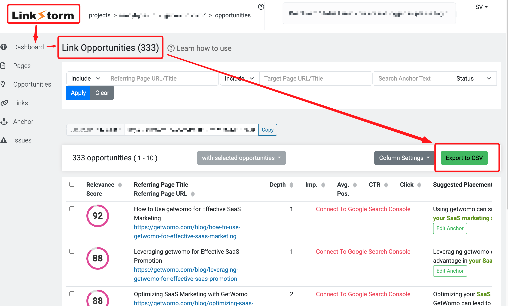

# Linkstorm Link Injection

1.  You need to export opportunities from https://linkstorm.io/projects
    

2.  You need to rename the exported opportunities to `opportunities.csv`

## Automated Deployment

1. You can deploy this repository, by clicking and following instructions.
2. Once deployed, you can replace the `opportunities.csv` file into the `data/` directory of your repository.

[](https://deploy.workers.cloudflare.com/?url=https://github.com/ssv445/linkstorm-link-injection/tree/main)

## Manual Deployment

1. Clone the repository
2. Place your `opportunities.csv` file into the `data/` directory of this repository
3. Install the project dependencies with a package manager of your choice:
   ```bash
   npm install
   ```
4. Deploy the project! Follow instructions.
   ```bash
   rpm run deploy
   ```

That's it! Your link injection worker should now be live.

# Changes required on your website

The linkstrom injection script you have installed, need a little addition. A custome server URL, to fetch opportunity from, which is the URL of above deployed cloudflare worker.

Replace

```

<script defer src="https://linkstorm.io/linkstorm_site_linker.js?projectId=PROJECT_ID&websiteId=WEBSITE_ID">
</script>
```

to

```
<script defer src="https://linkstorm.io/linkstorm_site_linker.js?projectId=PROJECT_ID&websiteId=WEBSITE_ID&serverDomain=YOUR_CLOUDFLARE_WORKER_URL";">
</script>
```

where YOUR_CLOUDFLARE_WORKER_URL is a full URL (includes https://) like `https://YOUR-CUSTOM-END-POINT.workers.dev`
